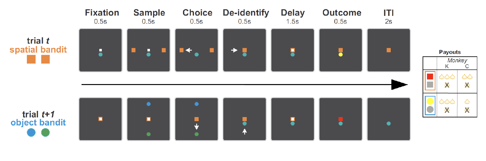

# Lagged bandit task

## Simulating lagged bandit task environment

For each trial, the agent will receive the following inputs:

- spatial choice on trial t
- object choice on trial t
- spatial reward on trial t
- object reward on trial t
- green target (high value target) position on trial t+1
- the trial number in current block for trial t